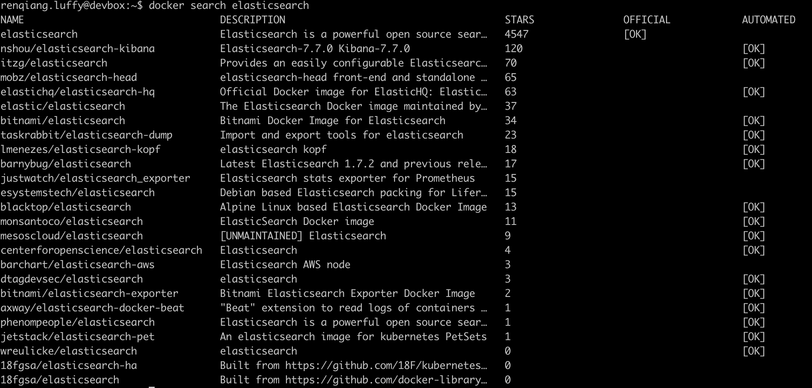
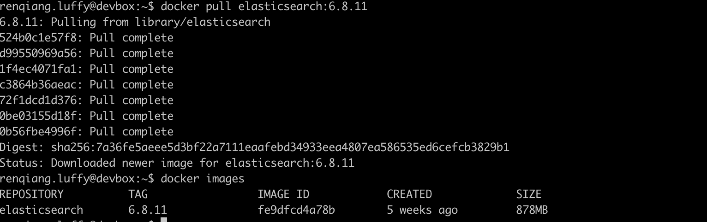
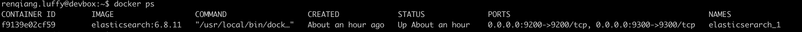
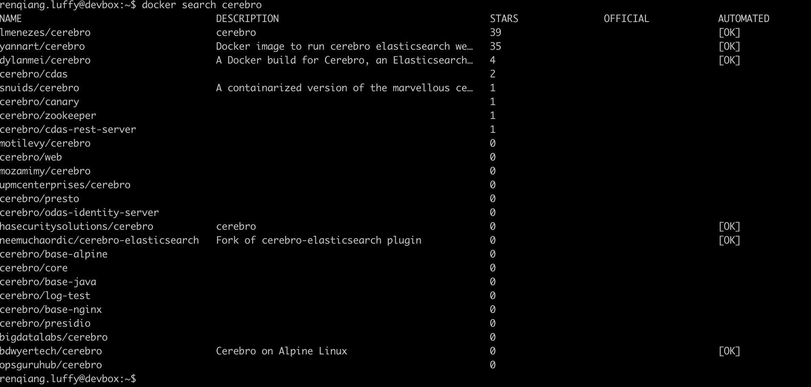
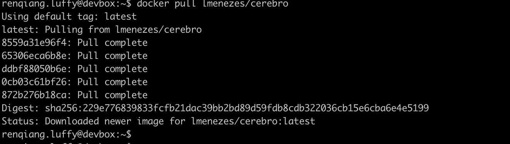
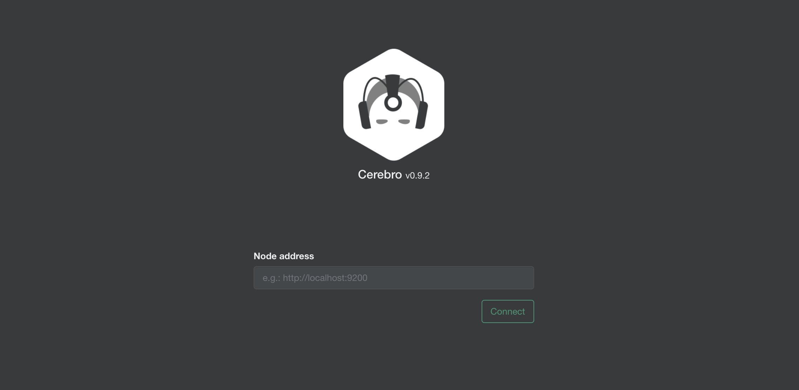
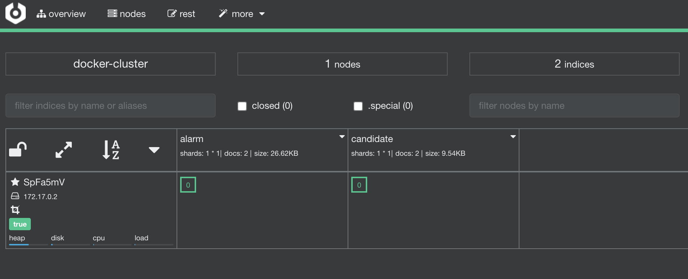

## 1. Docker 安装ElasticSearch


```
docker search elasticsearch
```




```sh
docker pull elasticsearch # 默认会拉取 latest 版本
docker pull elasticsearch:6.8.11  # https://hub.docker.com/ 版本查找
docker images # 查看本地images
```




```sh
 docker run -d --name elasticserarch_1 -p 9200:9200 -p 9300:9300 elasticsearch:6.8.11
```


```
docker ps
```




```sh
curl http://devbox:9200/
```


## 2. docker 安装Cerebro

```sh
docker search cerebro
```



```sh
docker pull lmenezes/cerebro
```



```sh
docker run -d -p 9002:9000 \
--restart=unless-stopped \
--name cerebro \
-v /etc/localtime:/etc/localtime \
-v cerebro:/opt/cerebro \
-h cerebro \
lmenezes/cerebro
6f036de7c87672903c88f6590d40d052e8c7b79767e410e35b1f2162c268b63f
```

> docker run 参数说明
>
> https://www.runoob.com/docker/docker-run-command.html?ivk_sa=1023345p

访问`http://ip:9002` 并配置集群



配置完成后点击 `connect`, 下图中已经建立好两个`Index`




> ```sh
> docker run -id 
> ```
> https://www.runoob.com/docker/docker-run-command.html
> https://blog.csdn.net/qq_19381989/article/details/102781663


> ```sh
> curl
> ```
>
> 


