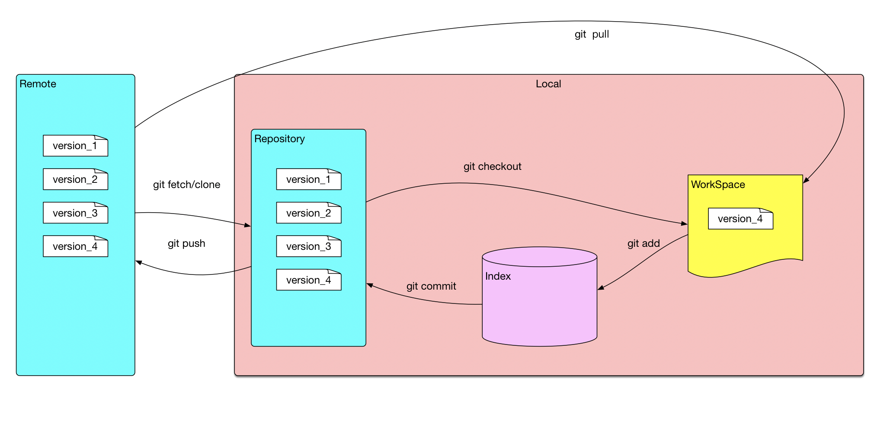
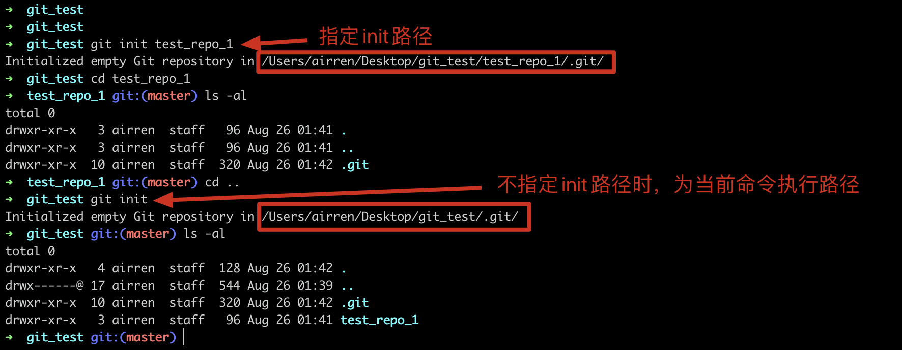
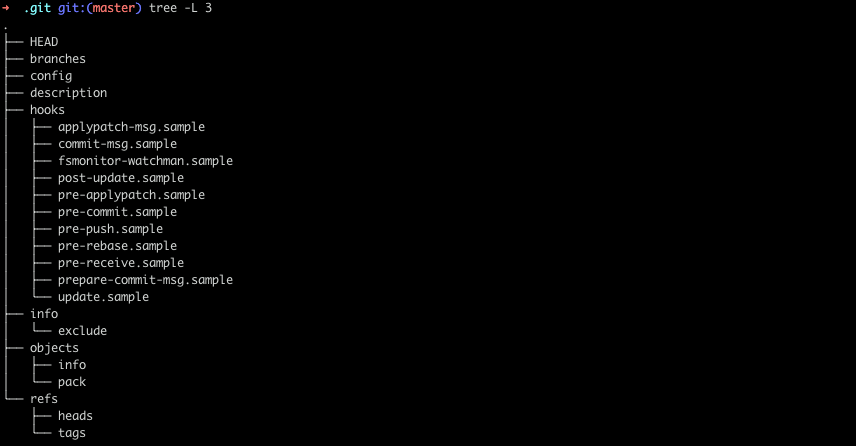
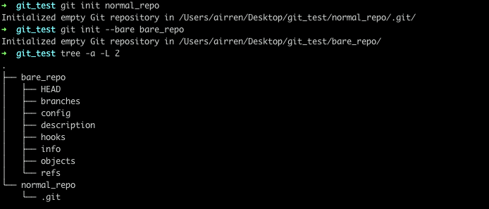

## Git 数据存储的基本概念

WorkSpace: 工作区，编辑修改文件的区域

Index/Stage: 暂存区， 未提交修改

Repository： 本地仓库

Remote： 远程仓库

我们使用编辑器写代码的区域就是WorkSpace, 执行`git add fileName`之后，就将修改的文件提交到了暂存区，执行`git commmit -m "update fineName"` 之后就将修改提交到了本地版本库。最后使用 `git push` 将修改提交到远程仓库。


## Git 常用操作

### 配置用户名以及邮箱

设置

```sh
git config --global user.Name "name"
git config --global user.email "xxx@outlook.com"
```

查看

```sh
git config user.name
git config user.email
```

### 初始化Git仓库 git init

```sh
git init fileName
# or 不指定路径，默认为当前路径
git init
```



初始化仓库后，会生成一`.git`的隐藏文件夹




**建立裸仓库**

```sh
git init --bare bare_repo
```



对比正常git仓库`normal_repo`与`bare_repo`的目录结构发现，在`normal_repo/.git` 文件夹中的文件直接出现在了`bare_repo` 中

切换分支。


在一个裸仓库中执行`git`命令会提示`this operation must be run in a work tree`。因为裸仓库是没有工作区的，只会记录git提交的历史信息，`git log`可以查看提交历史，但是没有办法进行版本回退或者切分分支的操作。

 但是可以通过`hooks`建立一个单独存放源码的文件夹，将git仓库与项目源码分离存放。远程仓库往这个repo的推送更新会更新源码文件夹的内容。可以看一下这个技巧在[Hexo部署中的实战](../hexo/hexo_create.md).


### 切换branch

切换本地的branch


切换到远程branch 到本地

### 切换commit


### 多次commit合并为一个commit

```sh
git rebase -i <commitId> 
```

`commitId`是不需要被合并的一次commit， 是需要合并的commit的上一个commitId。


### 修改commit信息

修改历史commit信息：同上

修改最新的一次commit的信息

```sh
git commit --amend "message"
```


### rebase和merge的区别


### git stash 的使用

`git stash`用于临时保存和恢复修改, 可以跨分支

> 在未`add`之前才能执行`git stash`


`git stash [save] [message]`
 保存，`save`为可选项，`message`为本次保存的注释

`git stash list`
 所有保存的记录列表

`git stash pop stash@{num}`
 恢复，`num`是可选项，通过`git stash list`可查看具体值。**只能恢复一次**

`git stash apply stash@{num}`
 恢复，`num`是可选项，通过`git stash list`可查看具体值。**可回复多次**

`git stash drop stash@{num}`
 删除某个保存，`num`是可选项，通过`git stash list`可查看具体值

`git stash clear`
 删除所有保存


> 需要解决的问题
>
> 1. git stash 是保存在了哪里
> 2. git reset & git revert
> 3. git rebase
> 4. git init & git init -bare、
> 5. 解决冲突
