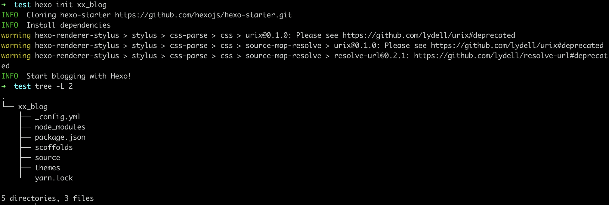

## Hexo 安装

https://hexo.io/zh-cn/docs/

1. 安装Node.js

2. 安装Git

3. 安装Hexo

  ```sh
  sudo npm install -g hexo-cli
  ```

  如果在mac中安装报`/usr/lib/node_modules/`的操作权限问题，执行以下命令。

  ```sh
  sudo chown -R `whoami` /usr/local/lib/node_modules
  ```

4. 初始化项目

   ```sh
   hexo init blog
   ```

   

   创建完成后，当前目录下会有一个`xx_blog`的文件夹，具体的文件夹查询官网hexo.io

   

   ## Hexo 部署到Nginx & Github.io

   ### 开发机

   在自己写Blog的Pc上安装插件

   ```sh
   yarn add hexo-deployer-git
   ```

   

   ### 服务器

   1. 在即将部署的服务器上执行以下操作

   ```sh
   yam install git 
   
   useradd -m git  # 创建一个git用户，用来运行git服务
                   # 新建git用户并非必要，但是为了安全起见，还是用git用户单独来运行git服务
   
   passwd git
   
   ```

   2. 设置PC到服务器的git用户免密登录
    ```sh
    # 生成ssh密钥
    ssh-keygen
    # 将公钥添加到server
    ssh-copy-id git@serverIp
    ```

   3. 在服务器上初始化一个Git仓库

   ```sh
   mkdir -p /var/repo
   ca /var/repo
   git init --bare blog.git  # --bare 初始化一个裸仓库，裸仓库没有工作区，只为共享而存在
   chown -R git:git blog.git
   ```

   ​	配置Git hooks

   ```sh
   mkdir /var/repo/blog.git/hooks
   vi post-receive
   ```

   ​	写入以下内容

   ```sh
   #!/bin/sh
   git --work-tree=/home/www/hexo --git-dir=/var/repo/blog.git checkout -f
   # /home/www/hexo 是部署目录。 每次push完成之后 
   ```

   ​	增加可执行权限

   ```sh
   chmod +x /var/repo/blog.git/hooks/post-receive
   ```
   > 禁用git用户的shell登录权限
>
   > ```sh
> vi /etc/passwd
   > # git:x:1001:1001:,,,:/home/git:/bin/bash
> git:x:1001:1001:,,,:/home/git:/usr/bin/git-shell
   > ```
   >
   > 
   
4. 部署nginx
   
   创建需要的代理文件夹
   
      ```sh
      mkdir -p /home/www/hexo      #创建目录
      chown -R git:git /home/www/hexo   # 增加git用户权限
      ```
   
      修改nginx配置`/etc/nginx/nginx.conf`
   
      ```sh
          server {
              listen       80 default_server;
              listen       [::]:80 default_server;
              server_name  _;
              root         /home/www/hexo;
      
              include /etc/nginx/default.d/*.conf;
      
              location / {
              }
      
              error_page 404 /404.html;
               location = /40x.html {
              }
   
              error_page 500 502 503 504 /50x.html;
                  location = /50x.html {
              }
          }
      ```
   
   5. 配置hexo `_config.yml`
   
      ```yaml
      # URL
      ## If your site is put in a subdirectory, set url as 'http://yoursite.com/child' and root as '/child/'
      url: https://www.bytegopher.com   # 为了避免不必要的麻烦此处设置根域名 & 根目录
      root: /
      
      # Deployment
   ## Docs: https://hexo.io/docs/deployment.html
      deploy:
     type: git
        repo: 
       github: https://github.com/Airren/airren.github.io  # github repo
          alios: git@serverIp:/var/repo/blog.git   # server git repo for nginx
        branch: gh-pages  # branch name, whaterver
      ```

   6. 发布Blog

      写完博客之后直接发布就可以更新到Nginx服务器& Github.io

      ```
      hexo clean & hexo d -g
      ```
   
      
   
   
   
   **参考资料**
   
   https://www.jianshu.com/p/e1ccd49b4e5d