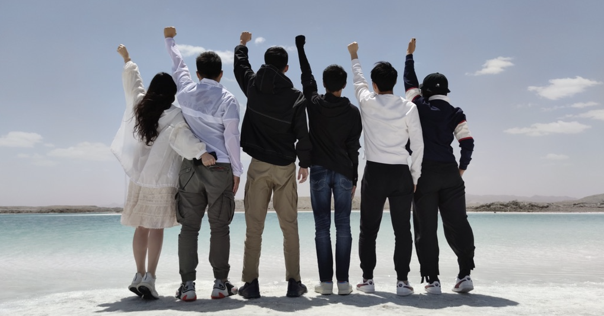
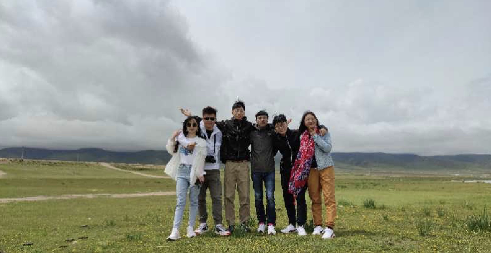
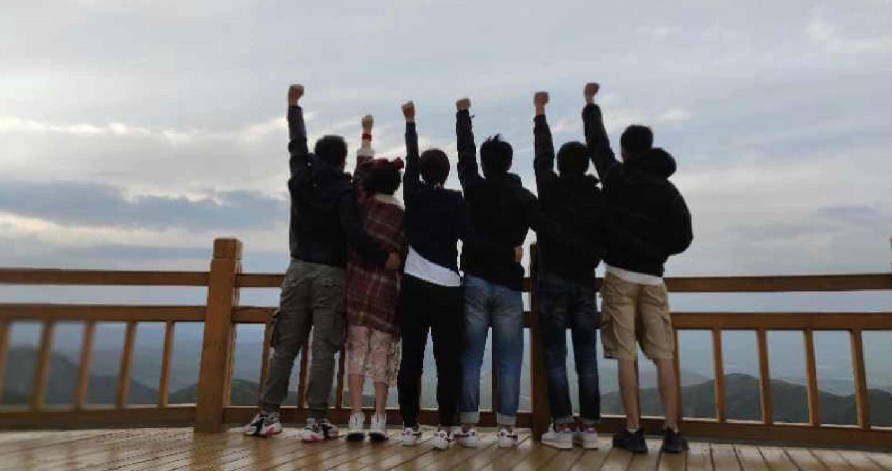

## 2020.06.21 上海 - 兰州

早上上海出发，下午16点到达兰州，然后到神州租车取上我们的战车——7座的科帕奇。虽然是七座，但是最后一排的空间小的可怜🤕。其实本来是想租一个霸道/路虎之类的，奈何第一次使用一嗨租车不让租高端车型。或许因为我们出游的时间是是个淡季，又或许是因为疫情的影响，这几天租车特别便宜。科帕奇只有360左右每天（含全险），现在看了一眼都600+每天了。同期的霸道只要600左右每天，现在1000+（没租上霸道感觉错过了一个亿）。

开上战车，寻了个离机场最近的美食街吃个拉面，必须是地道的牛肉拉面，便奔向曹家堡机场去与小伙伴回合。200+ 公里伴随着晴雨莫测的天气开了大约两个半小时。

夜宿西宁，吃肉去~

## 2020.06.22  西宁-青海湖

青海湖，最大的盐水湖。门票太贵了，没有进景区，好像景区内也没啥可看的(滑稽)。在附近转了转，风景也不错，湖边的游客也很多，还和白牦牛拍了合照。

有点阴天，云特别的低，但不像南方的阴雨天那样沉闷。空气中夹杂着山顶融化的雪水的气息。草地上点缀着些许的小黄花。

## 2020.06.25 门源-达坂山

既当金山之后第二段难开的山路，九曲十八弯。

达坂山观景台，收费5元/车。可以听停车休息一会。山顶的风甚是凛冽。

