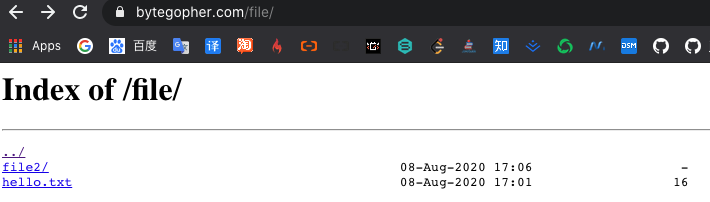

## 搭建静态资源服务器

静态资源文件夹

```sh
/root/file
```

Nginx 配置

`vi /etc/nginx/nginx.conf`

```sh
location /file {   # 这个file 跟资源路径的名字没有半毛钱关系，可以不同
				alias /root/file; # 静态资源的绝对路径
				autoindex on;    # 自动创建目录
}
```


为了提高文件的传输效率，降低带宽浪费，可以开启gzip压缩

```sh
gzip on;
gzip_minPlength 1;  # 小于1字节不压缩，
gzip_comp_level 2;  # 压缩级别为2 
gzip_types taxt/plain applicaton/x-javascripts txt/css application/xml image/jpeg image/gif image/png;  # 压缩文件类型

```


重启nginx服务

```sh
nginx -s reload
# or
systemctl restart nginx.service
```


通过浏览器访问资源




此时还有很多小伙伴大概率会遇到403 Forbidden， 试过将资源文件夹设置为`777 -R `权限或者`chown -R nginx:nginx file`。But, still doesn'r work。 

目前的解决方法是将`/etc/nginx/nginx.conf` 中的`user` 设置为`root ` 。

```sh
# user nginx 
user root 
```

