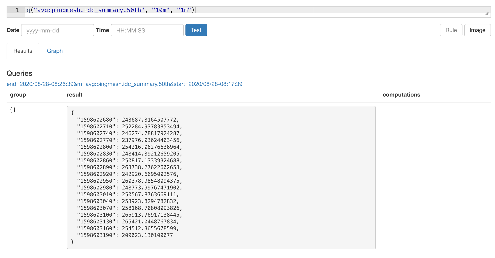
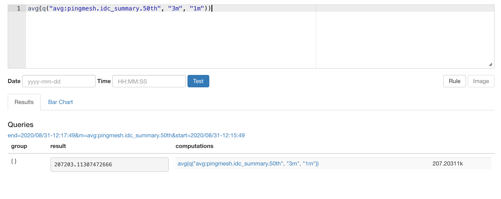
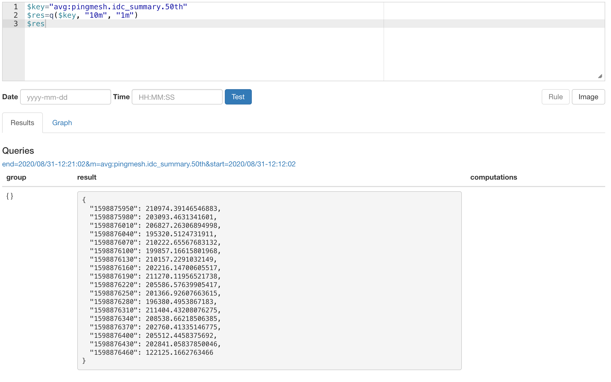

title: 「Bosun」开源报警系统
subtitle: 'Bosun语法以及使用'
author: Airren
catalog: true
header-img: ''
tags:
  - null
p: /tsdb/bosun
date: 2020-08-18 00:43:44

> 使用bosun之前首先要了解什么是时序数据，时序数据的组成部分以及时序数据的常用查询

## 时序数据的类型

counter

guage(store)

## Bosun的数据类型

- Scalar
- NumberSet：   Group+Scalar

## Bosun 查询语法

### 简单查询

查询过去10分钟到过去1分钟之间的时序数据

`avg`是时序数据库的的运算，对不同的tag set的数据求平均

最外面的`avg` 是对这段时间内的时序数据做一个平均，得到一个数值

### 宏替换

运算的时候会对变量进行宏替换

Streak 连续非0 数据的最大长度

https://blog.csdn.net/lslxdx/article/details/79454916