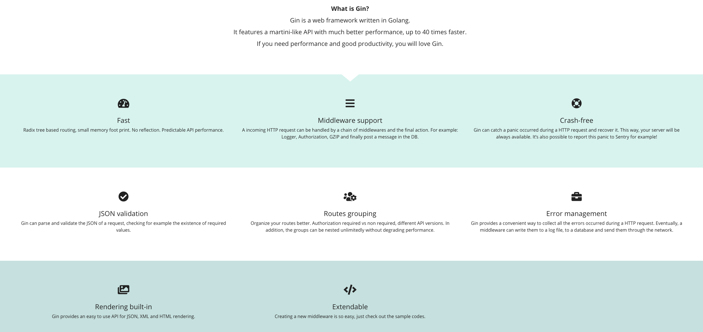
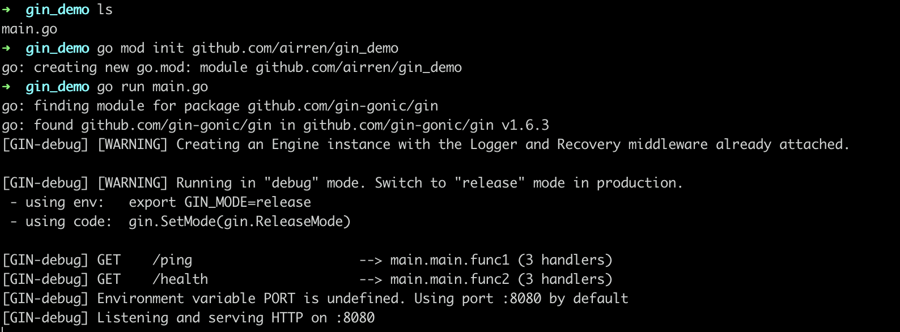
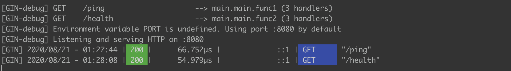

> 学好一个框架或者一门语言，最好的方法就是要学会看官方的Document。几乎所有的博客只是把自己对官方文档的理解重新加工整理出来而已，增加了自己的主管想法。
>
> 刚入门的时候面对英文文档可能一头雾水，但是当你坚持下来，你会发现，这些官方文档写的要比那些博客好的多，表述精确的多。
>
> 以后我的文章会主要参考官方文档展开介绍，顺带加一点自己的理解

[GitHub](https://github.com/gin-gonic/gin) 

[Official Document](https://gin-gonic.com/)

## 1. Gin 简介

> The fastest full-featured web freamwork for Go. Crystal clear.



- 快
- 支持中间件
- Crash还原
- JSON验证
- 路由分组
- 错误日志收集
- 模板渲染
- 可扩展


## 2. 快速用Gin搭建一个Web服务

```sh
go get -u github.com/gin-gonic/gin  # install Gin

mkdir gin_demo && cd gin_demo

vi main.go
```


`main.go`的内容如下

```go
package main

import (
	"net/http"
	"github.com/gin-gonic/gin"

)

func main(){
	r  := gin.Default()
  
	r.GET("/ping", func(c *gin.Context){
		c.JSON(200, gin.H{
			"message":"pong",
		})
	})

	r.GET("/health", func(c *gin.Context){
		c.String(http.StatusOK, "ok")
	})
	r.Run()
}
```


然后初始化GoModule, 运行项目

```sh
go mod init xxx/xxx/gin_demo

go run main.go
```



如上图所示，一个简单的web服务就搭建成功了

测试一下访问情况


服务端日志



由于`gin.Default()` 返回的`gin.Engine` (router)自带`Logger`中间件，所以可以在日志中看到具体的请求与响应情况。看一眼源码

```go
// Default returns an Engine instance with the Logger and Recovery middleware already attached.
func Default() *Engine {
	debugPrintWARNINGDefault()
	engine := New()
	engine.Use(Logger(), Recovery())
	return engine
}
```


