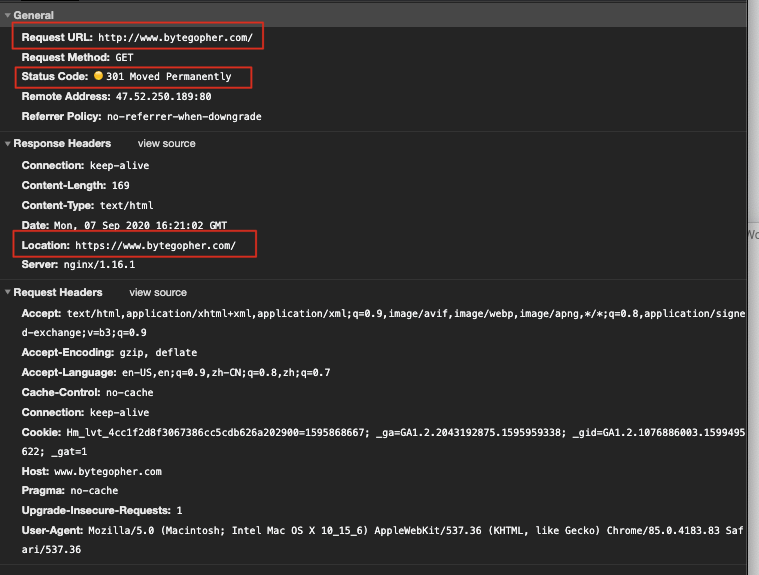

## 转发和重定向

之前看到一个很有趣的例子

重定向： 浏览器找张三借钱，张三没有钱，张三就把李四的地址给了浏览器，浏览器拿着李四的地址去借钱。浏览器一共发出两次请求，收到两次信息，知道最终的信息来源是来自李四。

转发： 浏览器找张三借钱，张三钱不够找到李四借了点，最后凑齐了给张三。浏览器一共只发起了一次请求，并不知道借来的钱有李四的一部分。

- 转发浏览器Url的地址不变，重定向浏览器URL的地址改变
- 转发是服务器行为，重定向是客户端行为
- 转发 浏览器只发起了一次请求，重定向浏览器发起了两次请求

## HTTP重定向

301永久重定向

