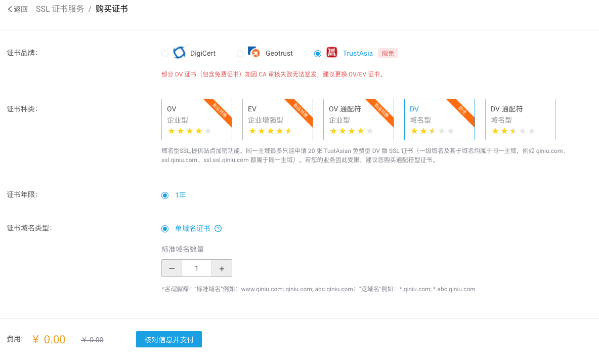
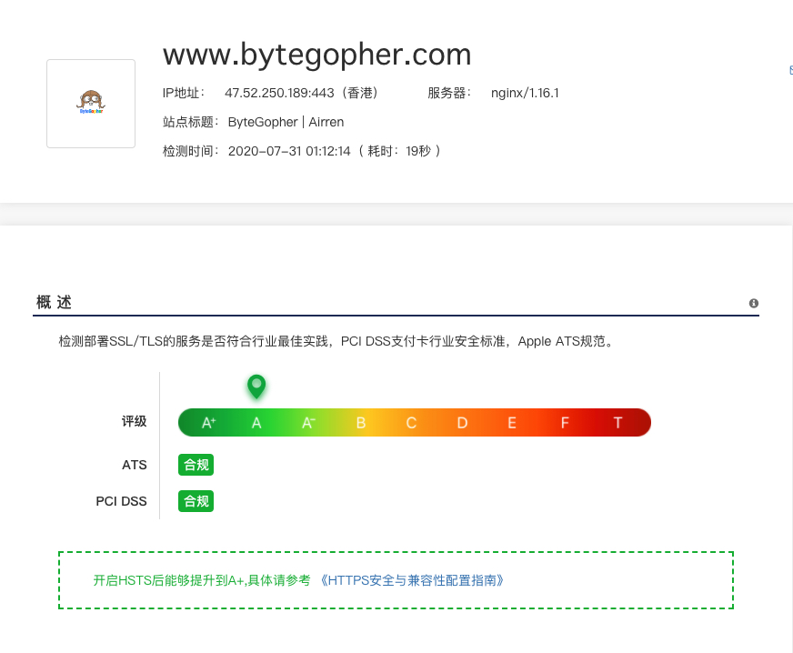

# 什么是HTTPS


# 申请免费SSL
[七牛云免费SSL申请](https://portal.qiniu.com/certificate/apply)


# Nginx 部署设置https

`vi /etc/nginx/nginx.conf`

```sh
  server {
        listen       443 ssl http2 default_server;
        listen       [::]:443 ssl http2 default_server;
        server_name  www.bytegopher.com;  # bind the domain name
        root         /var/www/hexo;  
        index        index.html index.htm;

        ssl_certificate /etc/nginx/bytegopher.com/bytegopher.com.crt;   # absolute path of certificate
        ssl_certificate_key /etc/nginx/bytegopher.com/bytegopher.com.key; # absolute path of certificate
        ssl_session_timeout 5m;
        ssl_protocols TLSv1.1 TLSv1.2;
        ssl_ciphers ECDHE-RSA-AES128-GCM-SHA256:ECDHE:ECDH:AES:HIGH:!NULL:!aNULL:!MD5:!ADH:!RC4:!DH:!DHE;
        ssl_prefer_server_ciphers on;

        # Load configuration files for the default server block.
        include /etc/nginx/default.d/*.conf;


        error_page 404 /404.html;
            location = /40x.html {
        }

        error_page 500 502 503 504 /50x.html;
            location = /50x.html {
        }
    }
    
    # 如果是http请求则自动转换为https
    server {
        listen 80;
        server_name www.bytegopher.com;
        rewrite ^(.*) https://$server_name$1 permanent;
    }
```

# SSL 状态检测
[状态检测](ttps://myssl.com/www.bytegopher.com?domain=www.bytegopher.com&status=success#certificates)



> 如何查看一个网站的非https请求 \
> chrome 调试模式的console 中会输出非https请求